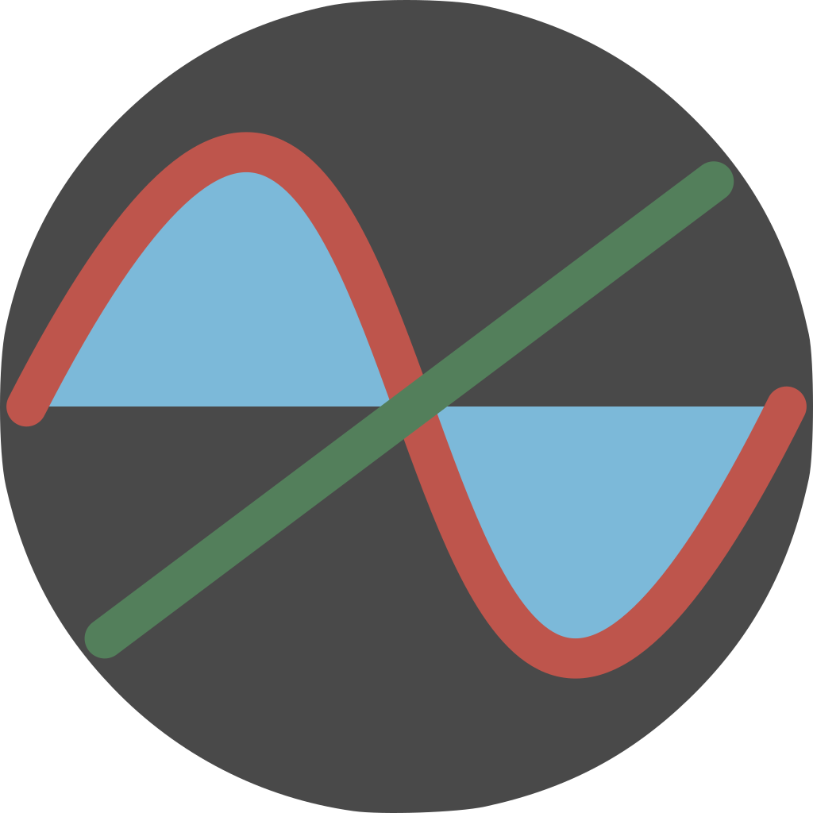

## (Yet-To-Be-Named) Graphing Software

<!-- Logo -->

### What is this?
The aim of this project is to provide a [Desmos](https://www.desmos.com/)-like graphing experience. This project is written in [Rust](https://www.rust-lang.org/) and takes advantage of [egui](https://github.com/emilk/egui) as it's graphical backend. Meaning that this program can be compiled targeting either the web, [such as here](https://titaniumtown.github.io), as well as a native application.
